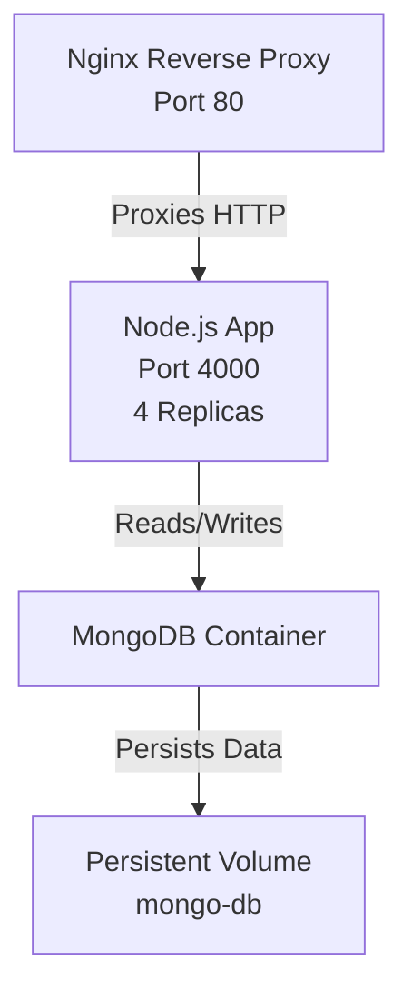
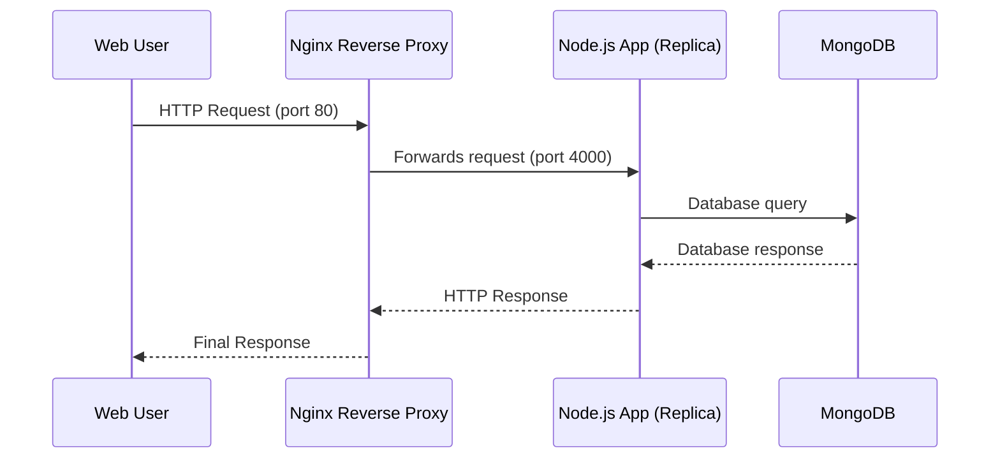

# Project Infrastructure & Configuration Documentation

This documentation details the configuration and orchestration files for a Node.js application using Docker, Docker Compose, Nginx, and MongoDB. Each file serves a key purpose in development, deployment, and security. Below, you'll find comprehensive explanations and code references for each configuration artifact.

---

## `.dockerignore`

This file tells Docker which files and directories to ignore when building images. Excluding unnecessary files speeds up builds and keeps images secure and small.

**Content:**
```dockerignore
/node_modules
docker-compose*
```

**Explanation:**
- `/node_modules`: Prevents local dependencies from being copied into the Docker image. The image will install dependencies as needed.
- `docker-compose*`: Excludes all files starting with `docker-compose` (e.g., `.yml` files), keeping sensitive or environment-specific orchestration files out of the image.

---

## `.gitignore`

This file ensures that sensitive or bulky files do not end up in your Git repository.

**Content:**
```gitignore
/node_modules
/.env
```

**Explanation:**
- `/node_modules`: Avoids committing potentially huge, platform-specific dependency folders.
- `/.env`: Keeps environment variables (such as secrets and credentials) private.

---

## `.env`

The `.env` file holds environment variables loaded into services at runtime to configure things like ports and database credentials.

**Content:**
```env
PORT=4000
DB_USER=root
DB_PASSWORD=example
DB_HOST=mongo
DB_PORT=27017 
```

**Explanation:**
- `PORT=4000`: The port on which the Node.js app runs.
- `DB_USER`, `DB_PASSWORD`: Credentials for MongoDB.
- `DB_HOST=mongo`: Points to the MongoDB service (by Compose service name).
- `DB_PORT=27017`: Default MongoDB port.

---

## `Dockerfile`

The Dockerfile defines how to build the Node.js application image for both development and production.

**Content:**
```dockerfile
FROM node:22-alpine as base
RUN apk add --no-cache bash #base stage

FROM base as development
WORKDIR /app
COPY package.json .
RUN npm install
COPY . .
EXPOSE 4000
CMD ["npm", "run","start-dev"]

FROM base as production
WORKDIR /app
COPY package.json .
RUN npm install --only=production
COPY . .
EXPOSE 4000
CMD ["npm", "start"]
```

**Explanation:**

- **Multi-stage builds**: Two stages, `development` and `production`, reduce image size and allow for different configurations.
- **Base Stage**: Installs bash atop Alpine-based Node.js for minimal size and shell access.
- **Development Stage**:
  - Installs all dependencies (including dev dependencies).
  - Mounts the app and starts in development mode (`npm run start-dev`).
- **Production Stage**:
  - Installs only production dependencies.
  - Runs the app with `npm start`.

---

## `docker-compose.dev.yml`

This Compose file configures the development environment.

**Content:**
```yaml
services:
  node-app:
    build:
      context: .
      target: development # Use the development stage from the Dockerfile
    volumes:
      - .:/app
    environment:
      - NODE_ENV=development
    command: npm run start-dev # Override default CMD
```

**Explanation:**

- **Build Context**: Uses the Dockerfile in the current directory and targets the `development` build stage.
- **Volume Mounting**: Mounts your app directory into the container for live code updates (hot reload).
- **Environment**: Sets `NODE_ENV=development`.
- **Command Override**: Ensures the dev server starts with hot reload.

---

## `docker-compose.prod.yml`

This Compose file sets up the production environment.

**Content:**
```yaml
services:
  node-app:
    build:
      context: .
      target: production # Use the production stage from Dockerfile
    environment:
      - NODE_ENV=production
    command: npm start # Override default CMD
```

**Explanation:**

- **Build Target**: Targets the optimized, production-ready image.
- **Environment**: Sets production environment variable.
- **Command Override**: Runs the `npm start` script for production.

---

## `docker-compose.yml`

This is the main Compose file for orchestrating services in production, including Node.js, MongoDB, and Nginx.

**Content (trimmed and formatted for clarity):**
```yaml
services:
  node-app:
    image: marco8raafat/docker-practice
    env_file:
      - .env
    depends_on:
      - mongo
    deploy:
      replicas: 4
      update_config:
        parallelism: 2
        delay: 10s
      restart_policy:
        condition: on-failure
        delay: 5s

  mongo:
    image: mongo
    restart: always
    volumes:
      - mongo-db:/data/db
    environment:
      MONGO_INITDB_ROOT_USERNAME: root
      MONGO_INITDB_ROOT_PASSWORD: example
    deploy:
      replicas: 1
      restart_policy:
        condition: on-failure
        delay: 5s

  nginx:
    image: nginx:stable-alpine
    ports:
      - "80:80"
    volumes:
      - ./nginx/default.conf:/etc/nginx/conf.d/default.conf
    depends_on:
      - node-app

volumes:
  mongo-db:
```

**Explanation:**

- **node-app**:
  - Uses a pre-built image (matching Docker Hub naming conventions).
  - Loads environment variables from `.env`.
  - Waits for MongoDB (`depends_on`).
  - Deploys 4 replicas with rolling update rules (2 at a time, 10s delay).
  - Restarts containers on failure.

- **mongo**:
  - Runs the official MongoDB image.
  - Persists data to a named volume (`mongo-db`).
  - Sets root credentials via environment variables.
  - Ensures only one replica.

- **nginx**:
  - Runs Nginx as a reverse proxy.
  - Binds port 80 and pulls its config from `default.conf`.
  - Waits for `node-app` to be available.

- **Volumes**:
  - Named volume `mongo-db` for MongoDB data persistence.

---

### System Architecture Diagram

This diagram visualizes how the Node.js app, MongoDB, and Nginx interact using Docker Compose.



---

## `default.conf`

This file configures Nginx to reverse proxy HTTP requests to the Node.js application.

**Content:**
```nginx
server {
  listen 80;
  location / {
    proxy_set_header X-Real-IP $remote_addr;
    proxy_set_header X-Forwarded-For $proxy_add_x_forwarded_for;
    proxy_set_header Host $http_host;
    proxy_set_header X-NginX-Proxy true;
    proxy_pass http://node-app:4000;
    proxy_redirect off;
  }
}
```

**Explanation:**

- **Port 80**: Handles all HTTP requests.
- **Proxy Headers**: Forwards client IP and original host info to the Node.js app.
- **Proxy Pass**: Routes all traffic to the `node-app` service on port 4000 (Docker Compose networking).
- **No Redirect**: Disables automatic redirects from the backend.

---

## How the Workflow Operates

1. **Development**: Use `docker-compose -f docker-compose.dev.yml up` for a live-reloading, local dev environment. Code changes update instantly.
2. **Production**: Use `docker-compose -f docker-compose.yml up` to launch a multi-replica, production-ready setup with Nginx load balancing and MongoDB persistence.
3. **Nginx**: Routes all HTTP traffic to Node.js containers, supporting rolling updates and failover.
4. **MongoDB**: All data is stored in a named Docker volume, so database contents survive restarts.

---

### Deployment Process Flow




## Quick Reference

| File                    | Purpose                                                                  |
|-------------------------|--------------------------------------------------------------------------|
| `.dockerignore`         | Prevents local files from being copied to image                          |
| `.gitignore`            | Stops secrets and dependencies from entering git                         |
| `.env`                  | Stores environment variables (se
